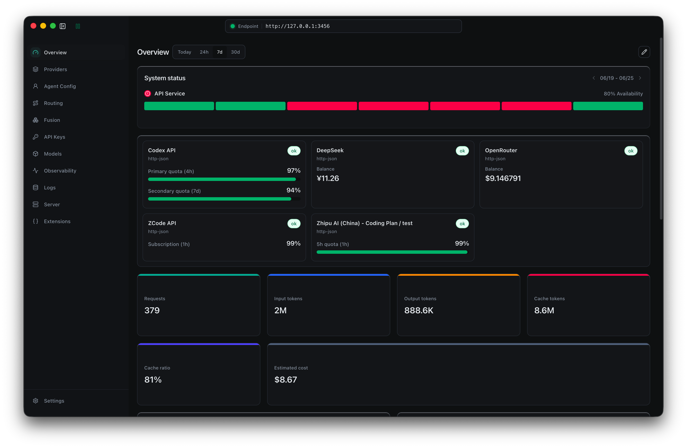

<h1 align="center">Claude Code Router Desktop</h1>

<p align="center">
  <a href="README.md"></a>
  <a href="https://discord.gg/rdftVMaUcS"></a>
  <a href="https://github.com/musistudio/claude-code-router/blob/main/LICENSE"></a>
</p>

<p align="center">
  
</p>

Claude Code Router Desktop 是一个本地网关和桌面控制台，用来把 Claude Code、Codex、ZCode 以及兼容客户端的 Agent 请求路由到你真正想使用的模型服务。

CCR 在你的本机运行，Provider 配置保存在本地配置目录，并默认暴露本地网关地址：`http://127.0.0.1:3456`。

## 为什么使用 CCR

- 用一个本地入口连接多个 Agent 工具，不需要在每个客户端里重复配置 Provider。
- 不同任务使用不同模型，例如后台任务、推理任务、长上下文、图片任务或支持联网搜索的模型。
- 在不改变工作流的情况下混用不同 Provider。CCR 支持 OpenAI 兼容 API、Anthropic Messages、Gemini Generate Content、OpenRouter、DeepSeek、SiliconFlow、Moonshot、Mistral、Z.AI、百炼以及自定义 Provider。
- 通过 fallback 路由、API Key 轮换、用量统计和请求日志来控制成本和可靠性。
- 使用桌面 UI 管理配置，减少手写 JSON。
- 通过插件、代理路由、本地 HTTP 后端和 Provider deeplink 扩展网关能力。

## 功能和特性

- **桌面控制台**：启动或停止本地网关，查看用量，配置托盘窗口和运行时设置。
- **Provider 管理**：添加预设或自定义端点，检测连通性，管理凭据，并在可用时查看账号余额。
- **路由规则**：配置默认、后台、thinking、长上下文、图片、Web Search、Subagent、模型前缀和条件路由。
- **Agent Profiles**：为 Claude Code、Codex 和 ZCode 配置指向 CCR 网关的 Profile。
- **网关兼容层**：通过本地 CCR wrapper 和 core gateway runtime 转换客户端请求。
- **代理模式**：通过本地代理捕获支持的 API 流量，可选系统代理和网络捕获。
- **插件系统**：安装或加载 wrapper 插件，包括 Claude Design、Cursor Proxy 这类集成路由。
- **虚拟模型**：为客户端暴露模型别名或组合模型配置，适配固定模型名场景。
- **Provider Deeplink**：通过 `ccr://provider?...` 链接导入 Provider 配置，写入前会弹出确认。

## 下载和安装

1. 打开 [GitHub Releases 页面](https://github.com/musistudio/claude-code-router/releases)。
2. 按系统下载对应安装包：
   - macOS：`Claude Code Router_<version>.dmg` 或 `.zip`
   - Windows：`Claude Code Router_<version>.exe`
   - Linux：`Claude Code Router_<version>.AppImage`
3. 安装并启动 **Claude Code Router**。
4. 首次启动后，CCR 会创建本地配置：
   - macOS/Linux：`~/.claude-code-router/config.json`
   - Windows：`%APPDATA%\Claude Code Router\config.json`

启用网关后，CCR 会启动两个本地服务：

- CCR wrapper gateway：`http://127.0.0.1:3456`
- Core gateway runtime：`http://127.0.0.1:3457`

## 快速开始

CCR 可以完全通过桌面 UI 完成配置。首次使用建议按下面顺序操作。

### 1. 添加 Provider

打开 **Providers**，点击 **Add Provider**，选择内置预设或创建自定义 Provider。按表单填写 Provider 名称、端点、协议、API Key 和模型列表。可用时先运行连通性检测，然后保存 Provider。

### 2. 设置路由

打开 **Routing**，先选择默认路由要使用的 provider/model。然后根据需要设置后台任务、Thinking、长上下文、图片任务和 Web Search 等场景的专用模型。

如果需要更细粒度控制，使用 **Add Routing Rule** 添加模型前缀、Subagent、请求条件或 fallback 规则。

### 3. 启动网关

打开 **Server**，点击 **Start** 启动本地网关。如果希望每次打开桌面应用时自动启动网关，可以启用 auto start。

### 4. 连接 Agent 工具

打开 **Profiles**，选择要使用的客户端。通过表单配置 Claude Code、Codex 或 ZCode Profile，选择目标模型并应用配置。对于 App 类型的 Profile，可以使用页面里的操作按钮通过 CCR 打开目标应用。

### 5. 日常查看和调整

使用 **Dashboard** 查看用量和 Provider 状态，使用托盘窗口快速查看 Token 和账号状态，使用 **Network Logs** 调试 Provider 行为，使用 **Extensions** 配置插件。

## Provider Deeplink

Provider 网站可以通过自定义协议打开 CCR 并导入模型服务配置：

```text
ccr://provider?name=Example%20AI&base_url=https%3A%2F%2Fapi.example.com%2Fv1&api_key=sk-example&models=example-chat%2Cexample-coder&protocol=openai_chat_completions
```

支持的 query 参数：

- `name`：Provider 展示名称。
- `base_url`：Provider API Base URL。别名：`baseUrl`、`api_base_url`、`url`、`endpoint`。
- `api_key`：可选 Provider API Key。别名：`apiKey`、`apikey`、`key`、`token`。
- `models`：逗号或换行分隔的模型列表，也可以重复传入 `model=...`。
- `protocol`：`openai_chat_completions`、`openai_responses`、`anthropic_messages` 或 `gemini_generate_content`。

更大的 payload 可以通过 URL 编码 JSON 或 base64url JSON 传入 `payload` 字段。CCR 在写入外部链接导入的 Provider 前，总会弹出确认窗口。

## 插件

CCR 有两层插件：

- Core gateway plugins：使用 `providerPlugins` 和 `virtualModelProfiles`，会透传给 core gateway。
- Wrapper plugins：使用顶层 `plugins` 扩展 Electron wrapper，注册本地 HTTP 后端、添加 gateway route，或把代理模式流量路由到插件后端。

Wrapper plugin route 示例：

```json
{
  "plugins": [
    {
      "id": "local-admin-api",
      "enabled": true,
      "proxy": {
        "routes": [
          {
            "id": "admin-api",
            "host": "api.example.com",
            "paths": ["/v1/admin"],
            "upstream": "http://127.0.0.1:4510",
            "stripPathPrefix": false
          }
        ]
      }
    }
  ]
}
```

插件模块需要导出函数或包含 `setup(ctx)` 的对象。上下文支持：

- `ctx.registerGatewayRoute({ method, path, auth, handler })`
- `ctx.registerHttpBackend({ id, host, port, handler })`
- `ctx.registerProxyRoute({ host, paths, upstream, stripPathPrefix, rewritePathPrefix, headers })`
- `ctx.openSqliteStore({ filename, migrate })`
- `ctx.registerCoreGatewayProviderPlugin(plugin)`
- `ctx.registerCoreGatewayVirtualModelProfile(profile)`

本地插件示例见 [examples/plugins](examples/plugins)。

## 开发

```bash
npm install
npm run dev
npm run typecheck
npm run build:assets
npm run build:app:mac
npm run build:app:win
```

`npm run build:assets` 会把 Electron main process 和 renderer assets 编译到 `dist/`。

`npm run build` 会为当前平台打包应用，并把安装包写入 `release/`。

`npm run build:app:mac` 和 `npm run build:app:win` 会分别打包对应平台的应用产物。Linux AppImage 打包配置在 `electron-builder.json` 中。

`npm run build:app:mac` 会在 `release-local/` 生成本地测试用 macOS 包，使用 ad-hoc 签名。它适合免费 Apple Account 或只有 Apple Development 证书的本机测试，但不适合公开分发，因为用户下载后仍无法通过 Gatekeeper 公证检查。

macOS 发布包会使用 Developer ID 签名并提交 Apple 公证。运行 `npm run build:app:mac:release` 前，打包机器必须具备：可用的 `Developer ID Application` 证书（在 keychain 中，或通过 `CSC_LINK`/`CSC_KEY_PASSWORD` 提供）、已通过 `xcode-select` 选择完整 Xcode，以及下面任意一组公证凭据：

- `APPLE_API_KEY`、`APPLE_API_KEY_ID`、`APPLE_API_ISSUER`
- `APPLE_ID`、`APPLE_APP_SPECIFIC_PASSWORD`、`APPLE_TEAM_ID`
- `APPLE_KEYCHAIN_PROFILE`，可选 `APPLE_KEYCHAIN`

macOS 打包 hook 会在产物生成前验证代码签名、公证票据 stapling 和 Gatekeeper 评估，避免发布未公证的安装包。

打包后的应用会通过 `electron-updater` 检查 GitHub Releases。测试本地更新源时，可以在启动应用前设置 `CCR_UPDATE_FEED_URL` 为 generic electron-updater feed URL。`CCR_UPDATE_ALLOW_PRERELEASE=1` 可以启用 prerelease 更新。

## 深入阅读

- [项目动机和工作原理](blog/zh/项目初衷及原理.md)
- [也许我们可以用路由器做更多事情](blog/zh/或许我们能在Router中做更多事情.md)

## 致谢

对 Codex 的支持以及 Bot handoff 来自于 [musistudio/codexl](https://github.com/musistudio/codexl) 这个项目。

## 支持与赞助

如果你觉得这个项目有帮助，欢迎赞助项目开发。非常感谢你的支持。

[](https://ko-fi.com/F1F31GN2GM)

[Paypal](https://paypal.me/musistudio1999)

<table>
  <tr>
    <td></td>
    <td></td>
  </tr>
</table>

### 我们的赞助商

非常感谢所有赞助商的慷慨支持。

- [AIHubmix](https://aihubmix.com/)
- [BurnCloud](https://ai.burncloud.com)
- @Simon Leischnig
- [@duanshuaimin](https://github.com/duanshuaimin)
- [@vrgitadmin](https://github.com/vrgitadmin)
- @\*o
- [@ceilwoo](https://github.com/ceilwoo)
- @\*说
- @\*更
- @K\*g
- @R\*R
- [@bobleer](https://github.com/bobleer)
- @\*苗
- @\*划
- [@Clarence-pan](https://github.com/Clarence-pan)
- [@carter003](https://github.com/carter003)
- @S\*r
- @\*晖
- @\*敏
- @Z\*z
- @\*然
- [@cluic](https://github.com/cluic)
- @\*苗
- [@PromptExpert](https://github.com/PromptExpert)
- @\*应
- [@yusnake](https://github.com/yusnake)
- @\*飞
- @董\*
- @\*汀
- @\*涯
- @\*:-）
- @\*\*磊
- @\*琢
- @\*成
- @Z\*o
- @\*琨
- [@congzhangzh](https://github.com/congzhangzh)
- @\*\_
- @Z\*m
- @\*鑫
- @c\*y
- @\*昕
- [@witsice](https://github.com/witsice)
- @b\*g
- @\*亿
- @\*辉
- @JACK
- @\*光
- @W\*l
- [@kesku](https://github.com/kesku)
- [@biguncle](https://github.com/biguncle)
- @二吉吉
- @a\*g
- @\*林
- @\*咸
- @\*明
- @S\*y
- @f\*o
- @\*智
- @F\*t
- @r\*c
- [@qierkang](http://github.com/qierkang)
- @\*军
- [@snrise-z](http://github.com/snrise-z)
- @\*王
- [@greatheart1000](http://github.com/greatheart1000)
- @\*王
- @zcutlip
- [@Peng-YM](http://github.com/Peng-YM)
- @\*更
- @\*.
- @F\*t
- @\*政
- @\*铭
- @\*叶
- @七\*o
- @\*青
- @\*\*晨
- @\*远
- @\*霄
- @\*\*吉
- @\*\*飞
- @\*\*驰
- @x\*g

（如果你的名字被打码，请通过我的主页邮箱联系我更新为 GitHub 用户名。）
